[](https://github.com/Daksh12345-del)

<h3 align="center">daksh@github ~ $ whoami</h3>

<p align="center">
  
  &nbsp;&nbsp;
  
</p>

<div align="center">
  
</div>

<div align="center">
  <a href="https://www.linkedin.com/in/daksh-singhal-178b56282/"></a>
  <a href="mailto:psinghal651@gmail.com"></a>
  <a href="/Daksh_Singhal_Resume.pdf"></a>
  
</div>

<div align="center">
  <a href="https://raw.githubusercontent.com/Daksh12345-del/Daksh12345-del/output/snake.svg">
    
  </a>
</div>

## 🧭 About Me

```
name:      Daksh Singhal
role:      Full-Stack Developer · B.Tech CSE Undergraduate
based in:  New Delhi, India
building:  Scalable, user-focused web apps — SaaS, client sites & automation tooling
stack:     React · Node.js · Express.js · PostgreSQL · Tailwind CSS · AWS
mindset:   Ship real products, from first commit to production — then iterate.
```

- 🚀 I build **full-stack products people actually use** — SaaS platforms, client websites, and automation tooling, most recently as an **IT Trainee at BLS International**.
- 🎓 Currently pursuing **B.Tech in Computer Science & Engineering** at ABES Engineering College (AKTU).
- 🛠️ Founder of **GradeWallah** — a SaaS platform for SGPA/CGPA tracking with a scalable PostgreSQL schema, built solo from idea to production.
- 💼 Solo-shipped **6 live client/production websites** — including a college admission platform, a real-estate discovery site, and an NGO donation platform.
- 🧪 Automate what I can — Selenium test suites, REST APIs, and AI-assisted tooling (Groq API).
- 🌱 Open-source contributor — **GSSoC '25** and **Hacktoberfest '25**.
- 💬 Ask me about React/Node full-stack architecture, PostgreSQL schema design, or turning a client brief into a shipped product.

## 🚀 Featured Projects

| Project | Focus | Core Stack |
|---|---|---|
| **[🎓 GradeWallah](https://github.com/Daksh12345-del/GRADEWISE_PROJECT)** · [live ↗](https://www.gradewallah.com) | SaaS for SGPA/CGPA tracking & academic analytics |    |
| **[🏫 Sarvpratham Edu Consultants](https://github.com/Daksh12345-del/COUNSELLING)** · [live ↗](https://www.sarvprathameduconsultants.com) | College admission & counselling platform (client) |    |
| **[🏢 Prime Builders](https://github.com/Daksh12345-del/prime_builders)** · [live ↗](https://www.primebuilders.co.in) | Real-estate discovery platform (client) |    |
| **[📊 DU College Predictor](https://github.com/Daksh12345-del/COUNSELLING)** · [live ↗](https://sarvprathameduconsultants.com/college-predictor.html) | CUET-based DU admission predictor |    |
| **[🛂 BLS Visa Appointment Portal](https://github.com/Daksh12345-del/BLS_USER_INTERNSHIP)** | Multi-step visa portal + admin panel (internship) |    |
| **[🌿 GreenPrint](https://github.com/Daksh12345-del/GREEN_PRINT_FRONTEND)** · [live ↗](https://greenprint-app.vercel.app/) | Live carbon/ESG scoring platform |    |

### 🎓 [GradeWallah](https://github.com/Daksh12345-del/GRADEWISE_PROJECT) · [Live ↗](https://www.gradewallah.com)

Founded and built a **full-stack SaaS platform** for SGPA/CGPA calculation and semester-wise academic tracking, backed by a scalable PostgreSQL schema supporting multi-semester data, user accounts, and analytics.

- Scalable PostgreSQL schema for multi-semester academic data
- Placement resources & internship listings
- DSA roadmap and performance analytics
- PDF report generation & study recommendations
- Secure authentication with responsive dashboards
- `React.js` · `Node.js` · `Express.js` · `PostgreSQL` · `Tailwind CSS` · `Vercel`

### 🏫 [Sarvpratham Edu Consultants](https://github.com/Daksh12345-del/COUNSELLING) · [Live ↗](https://www.sarvprathameduconsultants.com)

Solo-developed and deployed a **college admission platform for a real client** — a DU College Predictor, counselling package listings, enquiry management, and WhatsApp-based lead generation, live in production on a custom domain.

- DU College Predictor (Round 1, category-wise, source-verified)
- Counselling package listings across 20+ streams
- PostgreSQL schema for enquiry/lead tracking
- REST API endpoints for CRUD operations
- WhatsApp-based lead generation
- `React.js` · `Express.js` · `PostgreSQL` · `Tailwind CSS` · `WhatsApp API`

### 📊 [DU College Predictor](https://github.com/Daksh12345-del/COUNSELLING) · [Live ↗](https://sarvprathameduconsultants.com/college-predictor.html)

A CUET UG college & course predictor for Delhi University applicants — enter stream, category, and CUET marks to get a weighted, transparent chance-prediction across DU colleges, verified against source cutoff PDFs.

- Stream, category & course-based CUET input
- Best-4-of-5 paper scoring exactly as DU counts
- Round 1 category-wise, source-verified cutoff data
- Full cutoff list browser
- Talk-to-a-counsellor handoff
- `JavaScript` · `HTML` · `CSS` · Chart-based scoring logic

### 🛂 [BLS International — Visa Appointment Portal](https://github.com/Daksh12345-del/BLS_USER_INTERNSHIP)

Built solo during my internship — a multi-step visa application flow with email OTP verification, document upload with a live checklist, and reference number generation, plus a full Admin Control Panel. Shipped across **3 repositories in 2 months**.

- Multi-step visa application flow with email OTP verification
- Document upload with live checklist & reference number generation
- Admin panel: counters, city/country config, time-slot scheduling
- Groq API integration for AI-assisted features
- 7 automated Selenium test cases (login & booking flows)
- `React.js` · `Express.js` · `PostgreSQL` · `Groq API` · `Selenium`

### 🌿 [GreenPrint](https://github.com/Daksh12345-del/GREEN_PRINT_FRONTEND) · [Live ↗](https://greenprint-app.vercel.app/)

Built a **live carbon footprint & ESG scoring platform** that helps users and businesses track, calculate, and reduce their environmental impact through real-time data-driven insights.

- Real-time carbon footprint calculation & ESG scoring
- Interactive dashboards for tracking emissions over time
- Category-wise breakdown (energy, transport, waste, etc.)
- Personalized recommendations to reduce environmental impact
- Responsive, fast UI powered by Vite + React
- `React.js` · `Vite` · `Node.js` · `Tailwind CSS` · `Vercel`

## 🛠️ Tech Stack

<div align="center">

**Languages**

<table><tr>
<td align="center"><br/><sub><b>JavaScript</b></sub></td>
<td align="center"><br/><sub><b>Java</b></sub></td>
<td align="center"><br/><sub><b>C++</b></sub></td>
<td align="center"><br/><sub><b>HTML5</b></sub></td>
<td align="center"><br/><sub><b>CSS3</b></sub></td>
</tr></table>

**Frontend**

<table><tr>
<td align="center"><br/><sub><b>React</b></sub></td>
<td align="center"><br/><sub><b>Tailwind</b></sub></td>
<td align="center"><br/><sub><b>Vite</b></sub></td>
<td align="center"><br/><sub><b>Framer Motion</b></sub></td>
</tr></table>

**Backend & Data**

<table><tr>
<td align="center"><br/><sub><b>Node.js</b></sub></td>
<td align="center"><br/><sub><b>Express</b></sub></td>
<td align="center"><br/><sub><b>PostgreSQL</b></sub></td>
<td align="center"><br/><sub><b>Supabase</b></sub></td>
<td align="center"><br/><sub><b>AWS</b></sub></td>
</tr></table>

**Testing & Tools**

<table><tr>
<td align="center"><br/><sub><b>Git</b></sub></td>
<td align="center"><br/><sub><b>VS Code</b></sub></td>
<td align="center"><br/><sub><b>Selenium</b></sub></td>
<td align="center"><br/><sub><b>Postman</b></sub></td>
</tr></table>

**Design**

<table><tr>
<td align="center"><br/><sub><b>Canva</b></sub></td>
</tr></table>

</div>

## 📊 GitHub Analytics

<div align="center">

[](https://github.com/Daksh12345-del) [](https://github.com/Daksh12345-del)

[](https://github.com/Daksh12345-del)

</div>

### ✍️ Random Dev Quote

<div align="center">


</div>

## 📈 Contribution Graph

[](https://github.com/Daksh12345-del)

## 🎓 Education

- **B.Tech, Computer Science & Engineering** — ABES Engineering College, AKTU, Ghaziabad *(2024–2028, ongoing)*
- **Class 12** — Modern Convent School, Dwarka, New Delhi — 85.2%
- **Class 10** — Modern Convent School, Dwarka, New Delhi — 89.8%

## 🤝 Let's Connect

I'm always up for a good conversation — collaboration, freelance/internship opportunities, or full-stack project ideas.

<div align="center">
  <a href="https://www.linkedin.com/in/daksh-singhal-178b56282/"></a>
  <a href="mailto:psinghal651@gmail.com"></a>
</div>

*"Ship real, production-shaped software — then iterate."*
